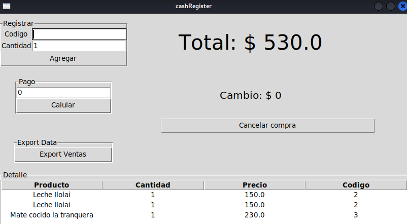
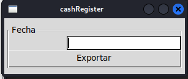

# cashRegister
Caja registradora con interfaz TKinter y base de datos SQLite.
Esta caja rejistradora es posible administrarla con el otro 
software, stockManage. Se puede usar la misma base de datos 
para los dos software usando un link simbolico.  

Tecnoligias usadas:
## Python

## Modo de uso:
1. Dentro de database encontraremos un archivo template de la base de datos. 
CREATE TABLE Stock (
	Stock_id INTEGER PRIMARY KEY,
	Codigo INTEGER NOT NULL,
	Stock INTERGER NOT NULL,
	Precio REAL NOT NULL,
	Descripcion TEXT NOT NULL
);

CREATE TABLE Ventas(
	Ventas_id INTEGER PRIMARY KEY,
	Codigo INTEGER NOT NULL,
	Producto INTEGER NOT NULL,
	Precio REAL NOT NULL,
	Fecha TEXT NOT NULL
);

Ingresar a sqlite3 y cargar estas tablas.
Una vez cargadas las tablas. Podes cargar tu stock directamente a mano mediante un 
cliente de sqlite3 o descargarte [stockManage](https://github.com/rosseab-bit/stockManage) y linkear la 
base mediante un enlace simbolico al de [stockManage](https://github.com/rosseab-bit/stockManage)

2. Inciar el programa desde la consola

$ python3 app.py

## Imagenes ilustrativas.
1. Asi es como se ve la ventana principal y unica del programa. En este panel podras realizar todas las operaciones
registrar las compras ingresar el el pago y calcular el vuelto segun el pago realizado.

## Export data

Podras exportar los datos de la base de datos hay que ingresar una fecha como un string
por ej: 2022 => esto te trae los registros de todo el 2022.
052022 => esto te trae el registro del mes 05 del año 2022.
09042022 => esto te trae los registros del dia 09 del mes 05 del año 2022.-

Por cualquir informacion puedes contactarme a:

[LinkedIn: Ricardo Benitez](https://www.linkedin.com/in/roseabdev/)
